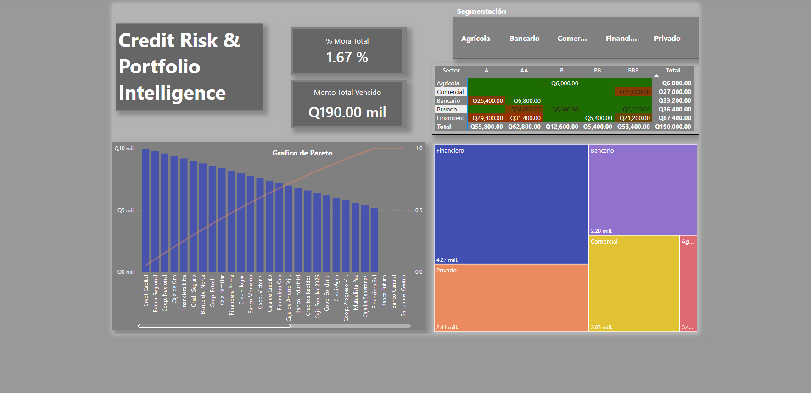

# Credit-Risk-Portfolio-Intelligence
Sistema de Inteligencia de Negocios (BI) para análisis de riesgo crediticio en Banca de Segundo Piso. Incluye modelado de base de datos original, consultas en SQL Server y dashboard interactivo en Power BI.

# Credit Risk & Portfolio Intelligence

## 🔍 Problemática
En el sector de la Banca de Segundo Piso, la gestión de riesgos a menudo se ve obstaculizada por dos grandes problemas:
1. **Datos Aislados:** La información transaccional suele estar fragmentada, lo que dificulta obtener una visión integral de la salud de la cartera crediticia.
2. **Gestión Reactiva:** Sin herramientas de visualización automatizadas, el equipo de cobranza trabaja "a ciegas", dedicando tiempo excesivo a reportes manuales en lugar de priorizar a los clientes que realmente impactan en la mora total.

Este proyecto surge de la necesidad de **centralizar** y **automatizar** este proceso, transformando datos aislados en una herramienta de Inteligencia de Negocios (BI) que permite identificar anomalías y concentraciones de riesgo de forma proactiva.

## 💾 Autoría y Diseño de Datos
**La base de datos fue creada por mi persona, desde cero.** No se trata de un dataset público ni extraído de internet. La arquitectura del modelo, la lógica de negocio (reglas de mora y segmentación) y las relaciones entre tablas fueron diseñadas y modeladas personalmente para simular un escenario financiero real y complejo.

## 🛠 Tecnologías y Herramientas
* **SQL Server (T-SQL):** Modelado de base de datos, limpieza, creación de variables de riesgo y consultas de agregación.
* **Power BI:** Visualización estratégica, modelado DAX (medidas de mora y acumulados) y diseño de interfaz de usuario.

## 📊 Visualización del Dashboard

*El tablero permite:*
* **Priorización mediante Pareto:** Identificar qué instituciones concentran el mayor impacto en la cartera vencida.
* **Mapa de Calor:** Visualizar la distribución del riesgo por sector y calificación.
* **KPIs Estratégicos:** Monitoreo inmediato del porcentaje de mora y monto total vencido.

## 💡 Impacto
Este sistema reduce el tiempo de análisis gerencial y optimiza la toma de decisiones, convirtiendo la gestión de riesgos en una ventaja competitiva para la institución.

---
*Desarrollado para el análisis de cartera institucional - 2026.*
